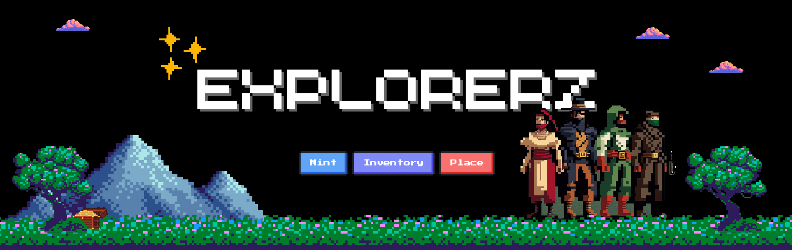

<div align="center">
(https://github.com/nrednav/explorerz/graphs/contributors)
(https://github.com/nrednav/explorerz/network/members)
(https://github.com/nrednav/explorerz/stargazers)
(https://github.com/nrednav/explorerz/issues)
(https://explorerz.vercel.app)
</div>

# Explorerz

Explorerz is a fun, creative and collaborative map building game built to run on
the Flow blockchain.

## Built With


<p align="right">(<a href="#readme-top">back to top</a>)</p>

## Getting Started

The following steps will guide you through getting this project setup locally on your machine.

### Pre-requisites

To build & interact with this project, you will need to have the latest version
of the [Flow CLI](https://developers.flow.com/tools/flow-cli) installed & setup.

You will also need to have [Node.js](https://nodejs.org/en/download/) installed.

### Installation

1. Clone the repository

```bash
git clone https://github.com/nrednav/explorerz.git
```

2. Install dependencies

```bash
npm install
```

### Configuration

There is a `.env.example` file in the project root directory.

Duplicate this, rename it to `.env` and you should be good to continue.

### Setup

You will need a total of 4 terminal sessions:

1. The Next.js app

```bash
npm run dev
```

2. Emulator

```bash
cd flow
flow emulator
```

3. Dev-Wallet

```bash
cd flow
flow dev-wallet
```

4. Project Deployment

```bash
cd flow
flow project deploy --network emulator
```

## Credits

- Game Texture Assets
  - Artist: [Jestan](https://ko-fi.com/jestan)
  - [Texture Pack](https://opengameart.org/content/pixel-texture-pack)
